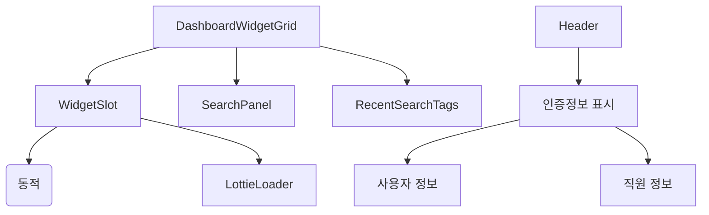
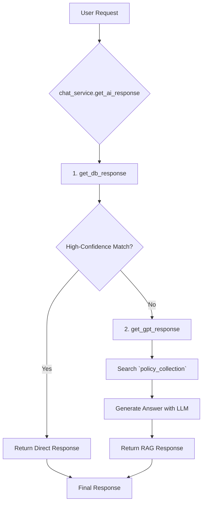
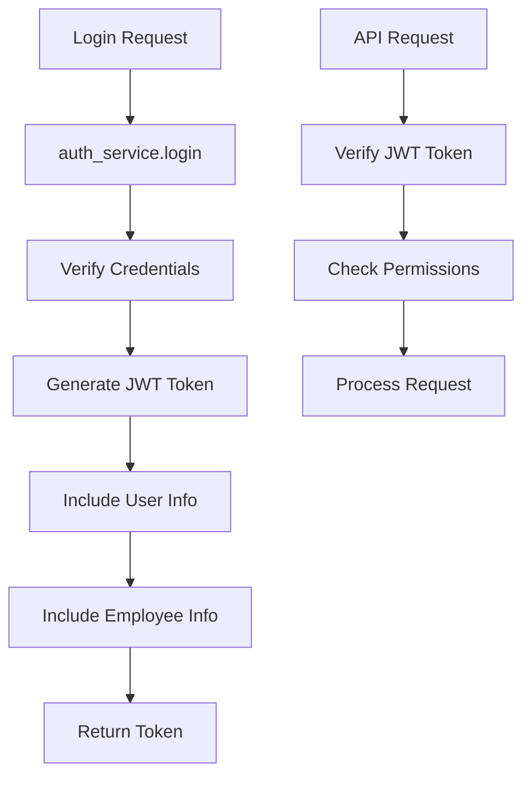

# 시스템 패턴

## 2024-06 최신 구조/패턴 요약

- **인증/권한 관리 패턴:**
  - JWT 토큰 기반 인증, 사용자별 권한 관리 (admin/user), 직원정보 연동
  - 프론트엔드에서 권한별 UI/기능 제어, 토큰 갱신 및 보안 관리
- **API 표준 응답 패턴:**
  - 모든 백엔드 API `{ success, code, message, data, error }` 구조로 통일, 프론트엔드 전체 일괄 적용.
- **공통 컴포넌트 패턴:**
  - CommonToast, CommonError, CommonLoading 등 공통 UI 컴포넌트 도입 및 전체 적용.
- **라우트/핸들러/서비스 분리:**
  - 백엔드 라우트(chat_routes 등), 서비스, 핸들러 계층 분리 및 app.py에서 직접 등록.
- **위젯 구조:**
  - 동적 import, 공통 스타일/컴포넌트 적용, UI/UX 일관성 강화.
- **프론트/백엔드 데이터 흐름:**
  - 표준화된 API 응답 구조, 데이터 구조 일관성, 공통 컴포넌트 활용.
- **보안/테스트:**
  - 환경 변수, XSS 방지(DOMPurify), 캐시/성능 최적화, 테스트 전략 강화.

## 아키텍처 개요
- **프론트엔드:** Vue 3, Vite, Pinia, Element Plus 기반 SPA
- **백엔드:** Flask 기반 API 서버, SQLAlchemy (ORM), LangChain, ChromaDB
- **인증:** JWT 기반 토큰 인증, 사용자별 권한 관리
- 위젯은 동적 import, 그리드/검색/상태 관리 분리

## 디자인 패턴
### 프론트엔드 패턴
- 동적 컴포넌트 로딩 (`defineAsyncComponent`)
- 전역 상태 관리 (Pinia)
- UI 피드백: Lottie 애니메이션, 로딩 인디케이터
- 권한별 UI/기능 제어 (v-if, computed 등)

### 백엔드 패턴 (Chat Service)
- **2-Step Sequential Pipeline:**
  1.  **Direct DB Search:** `chatbot_collection`에서 명시적 패턴(직원 검색, 메뉴 이동 등)을 먼저 검색.
  2.  **RAG (Retrieval-Augmented Generation):** DB 검색 실패 시, `policy_collection`에서 관련 문서를 검색하여 LLM(GPT)으로 답변 생성.
- **Prompt Engineering:** `gpt_prompt_profile.json`을 통해 시스템/사용자 프롬프트를 분리하여 관리.
- **인증/권한 관리:** JWT 토큰 생성/검증, 사용자별 권한 체크, 직원정보 연동

## 컴포넌트 관계
### 프론트엔드

### 백엔드 (Chatbot)

### 백엔드 (인증)

## 주요 기술 결정사항
- **인증 시스템:** JWT 토큰에 사용자 정보와 직원정보를 포함하여 프론트엔드에서 권한별 UI/기능 제어
- **Chatbot:** 정형화된 DB 검색과 비정형 문서 RAG를 순차적으로 결합하여 응답 속도와 답변 품질의 균형을 맞춤.
- **Frontend:** 위젯 동적 import로 초기 로딩 속도 최적화. `marked`와 `DOMPurify`를 사용해 안전하게 Markdown 렌더링.
- 로컬스토리지 기반 최근 검색 기능 제공.

## 데이터 흐름
- **인증 흐름:** Login -> JWT Token 생성 -> 프론트엔드 저장 -> API 요청 시 헤더 포함 -> 권한별 처리
- **정형 질문:** User -> API -> `get_db_response` -> `chatbot_collection` 검색 -> 구조화된 응답(JSON) 반환
- **비정형 질문:** User -> API -> `get_db_response`(실패) -> `get_gpt_response` -> `policy_collection` 검색 -> LLM -> Markdown 텍스트 응답 반환

## 보안 패턴
- **인증 보안:** JWT 토큰 기반 인증, 토큰 만료 관리, 권한별 접근 제어
- **Frontend:** `DOMPurify`를 사용하여 LLM이 생성한 HTML(마크다운 변환 결과)의 XSS 취약점 제거.
- 환경 변수를 사용하여 API 키 등 민감 정보 관리.

## 테스트 전략
- [전략 1]
- [전략 2]

## 참고사항
- 모든 아키텍처 결정사항과 그 근거를 문서화하세요
- 시스템이 발전함에 따라 이 문서를 업데이트하세요
- 인증 시스템 기반으로 사용자별 맞춤 서비스를 지속적으로 확장하세요 