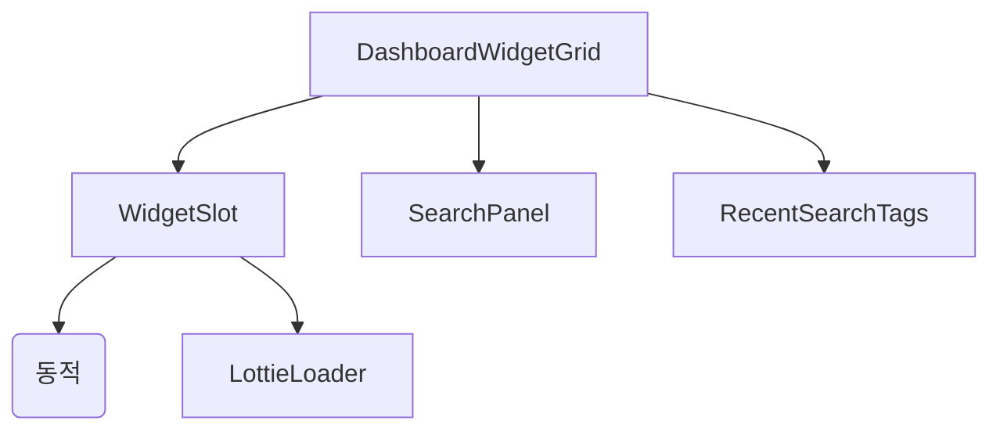
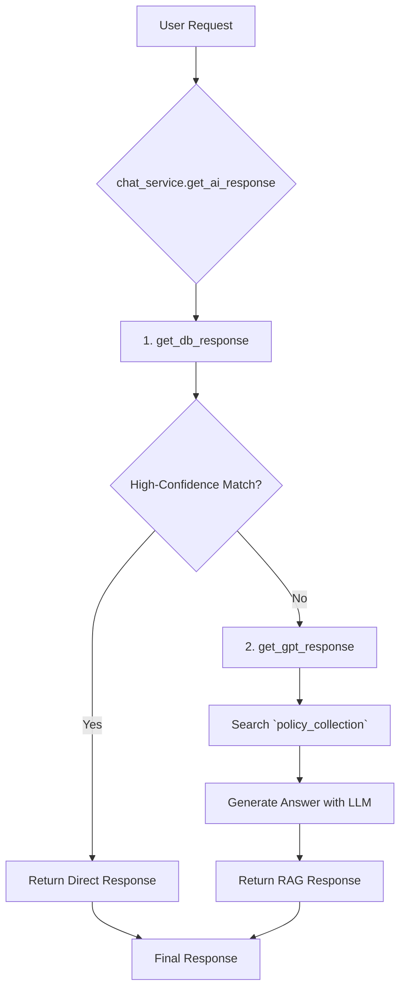

# 시스템 패턴

## 아키텍처 개요
- **프론트엔드:** Vue 3, Vite, Pinia, Element Plus 기반 SPA
- **백엔드:** Flask 기반 API 서버, SQLAlchemy (ORM), LangChain, ChromaDB
- 위젯은 동적 import, 그리드/검색/상태 관리 분리

## 디자인 패턴
### 프론트엔드 패턴
- 동적 컴포넌트 로딩 (`defineAsyncComponent`)
- 전역 상태 관리 (Pinia)
- UI 피드백: Lottie 애니메이션, 로딩 인디케이터

### 백엔드 패턴 (Chat Service)
- **2-Step Sequential Pipeline:**
  1.  **Direct DB Search:** `chatbot_collection`에서 명시적 패턴(직원 검색, 메뉴 이동 등)을 먼저 검색.
  2.  **RAG (Retrieval-Augmented Generation):** DB 검색 실패 시, `policy_collection`에서 관련 문서를 검색하여 LLM(GPT)으로 답변 생성.
- **Prompt Engineering:** `gpt_prompt_profile.json`을 통해 시스템/사용자 프롬프트를 분리하여 관리.

## 컴포넌트 관계
### 프론트엔드

### 백엔드 (Chatbot)

## 주요 기술 결정사항
- **Chatbot:** 정형화된 DB 검색과 비정형 문서 RAG를 순차적으로 결합하여 응답 속도와 답변 품질의 균형을 맞춤.
- **Frontend:** 위젯 동적 import로 초기 로딩 속도 최적화. `marked`와 `DOMPurify`를 사용해 안전하게 Markdown 렌더링.
- 로컬스토리지 기반 최근 검색 기능 제공.

## 데이터 흐름
- **정형 질문:** User -> API -> `get_db_response` -> `chatbot_collection` 검색 -> 구조화된 응답(JSON) 반환
- **비정형 질문:** User -> API -> `get_db_response`(실패) -> `get_gpt_response` -> `policy_collection` 검색 -> LLM -> Markdown 텍스트 응답 반환

## 보안 패턴
- **Frontend:** `DOMPurify`를 사용하여 LLM이 생성한 HTML(마크다운 변환 결과)의 XSS 취약점 제거.
- 환경 변수를 사용하여 API 키 등 민감 정보 관리.

## 테스트 전략
- [전략 1]
- [전략 2]

## 참고사항
- 모든 아키텍처 결정사항과 그 근거를 문서화하세요
- 시스템이 발전함에 따라 이 문서를 업데이트하세요 