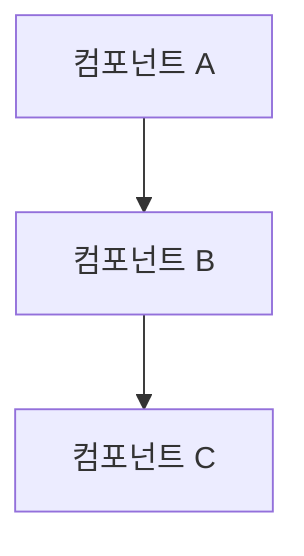

# 시스템 패턴

## 아키텍처 개요
[시스템 아키텍처에 대한 상위 수준 설명]

## 디자인 패턴
### 프론트엔드 패턴
- [패턴 1]
- [패턴 2]

### 백엔드 패턴
- [패턴 1]
- [패턴 2]

## 컴포넌트 관계

## 주요 기술 결정사항
- [결정사항 1]
- [결정사항 2]
- [결정사항 3]

## 데이터 흐름
[시스템 내 데이터 흐름에 대한 설명]

## 보안 패턴
- [보안 패턴 1]
- [보안 패턴 2]

## 테스트 전략
- [전략 1]
- [전략 2]

## 참고사항
- 모든 아키텍처 결정사항과 그 근거를 문서화하세요
- 시스템이 발전함에 따라 이 문서를 업데이트하세요 