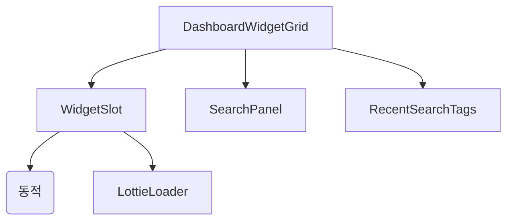

# 시스템 패턴

## 아키텍처 개요
- 프론트엔드: Vue 3, Vite, Pinia, Element Plus 기반 SPA
- 위젯은 동적 import, 그리드/검색/상태 관리 분리

## 디자인 패턴
### 프론트엔드 패턴
- 동적 컴포넌트 로딩
- 상태 관리(Pinia)
- Lottie 애니메이션 활용

### 백엔드 패턴
- [패턴 1]
- [패턴 2]

## 컴포넌트 관계

## 주요 기술 결정사항
- 위젯 동적 import
- 로컬스토리지 기반 최근 검색
- Lottie 애니메이션

## 데이터 흐름
- 검색 → 위젯 선택 → 그리드 배치 → 실시간/시뮬 데이터 표시

## 보안 패턴
- [보안 패턴 1]
- [보안 패턴 2]

## 테스트 전략
- [전략 1]
- [전략 2]

## 참고사항
- 모든 아키텍처 결정사항과 그 근거를 문서화하세요
- 시스템이 발전함에 따라 이 문서를 업데이트하세요 